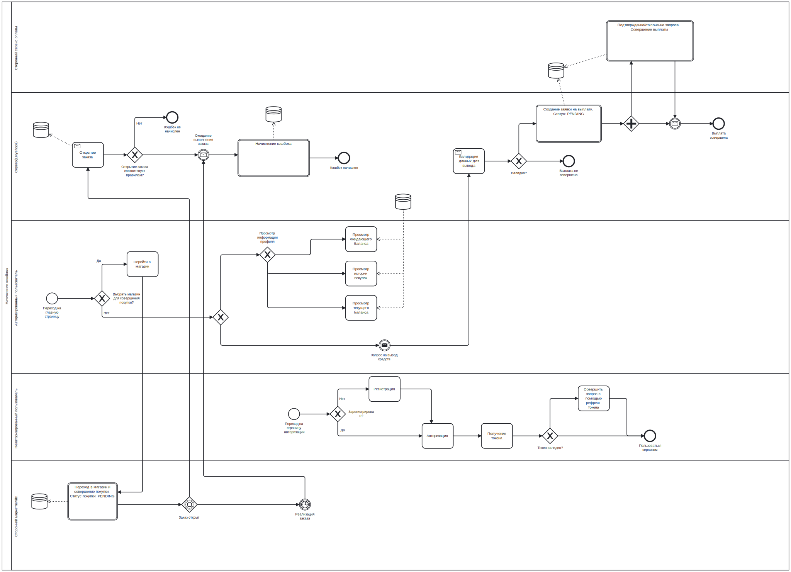

# Cashback-Web-Service
Web-service that interact with cash back 

## Configuration
* `Artemis`
```
docker run --name artemis -it -e ARTEMIS_USERNAME=<username> -e ARTEMIS_PASSWORD=<password> -p 8161:8161 -p 61616:61616 -p 5762:5762 vromero/activemq-artemis
```
* `Consul`
```
docker run -d --name consul -p 8500:8500 consul
```

## Properties
* `App`
```
spring.application.name=app
server.port=8080
spring.datasource.url=jdbc:postgresql://localhost:5432/cashback_service
spring.datasource.username=<username>
spring.datasource.password=<password>

spring.jpa.properties.hibernate.jdbc.lob.non_contextual_creation=true
spring.jpa.hibernate.ddl-auto=update
spring.jpa.properties.hibernate.dialect = org.hibernate.dialect.PostgreSQLDialect

transaction.service.port=8081
transaction.service.secret=<here must be your secret>
transaction.service.host=localhost

jwt.header=Authorization
jwt.secret=<here must be your secret>
jwt.access.expiration=3600
jwt.refresh.expiration=21600

spring.artemis.brokerUrl=tcp://localhost:61616
spring.artemis.user=<username>
spring.artemis.password=<password>

withdraw.send.queue=withdraw_send_queue
withdraw.approve.queue=withdraw_approve_queue

spring.cloud.consul.host=localhost
spring.cloud.consul.port=8500
spring.cloud.consul.discovery.register=true
spring.cloud.consul.discovery.register-health-check=false
spring.cloud.consul.discovery.service-name=${spring.application.name}
spring.cloud.consul.discovery.instanceId=${spring.application.name}
```

* `Transaction service`
```
spring.application.name=transaction
server.port=8081

spring.datasource.url=jdbc:postgresql://localhost:5432/cashback_service
spring.datasource.username=<username>
spring.datasource.password=<password>

spring.jpa.properties.hibernate.jdbc.lob.non_contextual_creation=true
spring.jpa.hibernate.ddl-auto=update
spring.jpa.properties.hibernate.dialect = org.hibernate.dialect.PostgreSQLDialect

jwt.header=Authorization
jwt.secret=topsecrettopsecrettopsecrettopsecret
jwt.expiration=3600

transaction.service.secret=<your secret must be here (same as in app props)>

spring.artemis.brokerUrl=tcp://localhost:61616
spring.artemis.user=<username>
spring.artemis.password=<password>
withdraw.send.queue=withdraw_send_queue
withdraw.approve.queue=withdraw_approve_queue
withdraw.scheduler.interval=10000

spring.cloud.consul.host=localhost
spring.cloud.consul.port=8500
spring.cloud.consul.discovery.register=true
spring.cloud.consul.discovery.register-health-check=false
spring.cloud.consul.discovery.service-name=${spring.application.name}
spring.cloud.consul.discovery.instanceId=${spring.application.name}
```

> To refresh app when changed properties on Github repository POST - `http://localhost:8080/actuator/refresh` 



